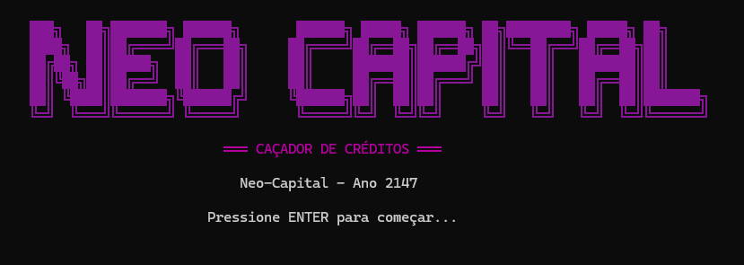
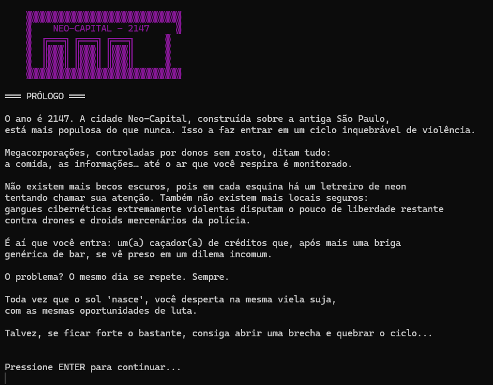

# Desenvolvimento de Jogos


Esse repositório contém todos os exercícios feitos em sala de aula e projetos relacionados a jogos.

**Chrome Shadows** é um jogo de RPG desenvolvido como parte de um projeto acadêmico (valendo 25 pontos na disciplina). Sua proposta traz uma narrativa envolvente em um cenário **Cyberpunk**, com batalhas interativas e cheias de ação.
Convidamos você a clonar o repositório e experimentar o jogo!

Usei o .NET 9 pra fazer todo o desenvolvimento do Jogo e dos exercícios.

---

## Instrução para executar

Clone este repositório:
```bash
git clone https://github.com/anajulialeite/Desenvolvimento_de_Jogos.git
```

```bash
f5
````

---

## Imagens do jogo inicalizando





## Autora

Ana Júllia de Lima Aguiar leite

<a href="https://www.linkedin.com/in/anajulialimaleite/" style="text-decoration:none" target="_blank" rel="noopener noreferrer">
    
</a>

## License

[](./LICENSE)
